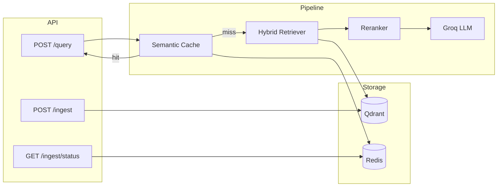

# Hybrid RAG — Employment Contracts

Production-style **Hybrid RAG** system over multi-document employment agreements (Honeywell + Cloudflare). Combines dense semantic search and sparse keyword retrieval in **Qdrant**, cross-encoder reranking, semantic caching, rate limiting, and async FastAPI serving.

Built as a freelance portfolio showcase with patterns you'd see in real production systems.

---

## Features

| Capability | Implementation |
|------------|----------------|
| **Hybrid retrieval** | Qdrant dense (Ollama) + sparse (BM25) with RRF fusion |
| **Reranking** | Cross-encoder (`ms-marco-MiniLM-L-6-v2` — small & fast) |
| **Company pre-filter** | Keyword detection → Qdrant payload filter |
| **Semantic cache** | Redis + embedding similarity (cosine ≥ 0.92) |
| **Rate limiting** | slowapi token bucket (10 req/min default) |
| **Dead letter queue** | Failed PDF ingest → Redis + SQLite fallback |
| **Async ingest jobs** | Background pipeline with status polling |
| **U-shaped context** | Best chunk placed first **and** last (lost-in-the-middle mitigation) |
| **Prompt structure** | Stable system prefix + dynamic context (prompt-cache aware) |

---

## Architecture

```
Client
  │
  ▼
FastAPI (Gunicorn + UvicornWorker in Docker)
  │  rate limiter
  ▼
RAG Chain (async)
  ├─ 1. Semantic cache (Redis)
  ├─ 2. Company pre-filter
  ├─ 3. Hybrid search (Qdrant: dense + sparse → RRF)
  ├─ 4. Cross-encoder rerank → top 5
  ├─ 5. U-shaped context reorder
  ├─ 6. Groq LLM
  └─ 7. Cache store + return sources

Ingest (background job):
  data/*.pdf → pdfplumber → chunk → Ollama embed + BM25 sparse → Qdrant upsert
```



---

## Tech Stack

| Layer | Technology |
|-------|------------|
| Orchestration | LangChain |
| Vector DB | **Qdrant** (dense + sparse in one collection) |
| Dense embeddings | Ollama (`snowflake-arctic-embed:137m`) |
| Sparse / keyword | FastEmbed BM25 (`Qdrant/bm25`) |
| LLM | Groq |
| Reranker | sentence-transformers CrossEncoder |
| API | FastAPI + Gunicorn (prod) / Uvicorn (dev) |
| Cache & jobs | Redis |
| PDF parsing | pdfplumber |
| Package manager | [uv](https://github.com/astral-sh/uv) |
| Containers | Docker + Docker Compose |

---

## Prerequisites

- **Python 3.12+**
- **[uv](https://docs.astral.sh/uv/)** (recommended) or pip
- **Docker & Docker Compose** (for Qdrant, Redis, and containerized API)
- **Ollama** running locally with the embedding model pulled:
  ```bash
  ollama pull snowflake-arctic-embed:137m
  ```
- **Groq API key** — [console.groq.com](https://console.groq.com)
- **PDF documents** in `data/`:
  - `data/honeywell_employment.pdf`
  - `data/cloudflare_employment.pdf`

---

## Quick Start (Docker — recommended)

### 1. Configure environment

```bash
cp .env.example .env
```

**Required:** set `GROQ_API_KEY` from [console.groq.com](https://console.groq.com).

**Optional:** set `INGEST_API_KEY` and `QUERY_API_KEY` (see [API Keys](#api-keys) below). For local testing you can leave them empty.

For Docker, Ollama runs on the host. The compose file defaults to:

```env
OLLAMA_BASE_URL=http://host.docker.internal:11434
```

### 2. Place PDFs

```bash
# Copy your employment agreement PDFs into:
data/honeywell_employment.pdf
data/cloudflare_employment.pdf
```

---

## Dependency Locking (uv)

After changing `pyproject.toml`:

```bash
uv lock
uv export --format requirements-txt --no-emit-project -o requirements.txt
```

- **`uv.lock`** — reproducible installs (used by Docker `uv sync`)
- **`requirements.txt`** — pip fallback when `uv sync` is unavailable in Docker

Commit both files to keep builds reproducible.

---

### 3. Start all services

```bash
docker compose up -d --build
```

This starts **Qdrant** (`6333`), **Redis** (`6379`), and the **API** (`8000`).

### 4. Ingest documents

```bash
# Start background ingest (add -H "X-API-Key: ..." if INGEST_API_KEY is set)
curl -X POST http://localhost:8000/ingest \
  -H "X-API-Key: YOUR_INGEST_API_KEY"

# Poll job status (replace <job_id> from response; no API key required)
curl http://localhost:8000/ingest/status/<job_id>
```

### 5. Query

```bash
curl -X POST http://localhost:8000/query \
  -H "Content-Type: application/json" \
  -H "X-API-Key: YOUR_QUERY_API_KEY" \
  -d "{\"query\": \"What is the notice period in Honeywell's agreement?\"}"
```

Omit the `X-API-Key` header if the matching variable is empty in `.env`.

**Postman:** Import `postman/Hybrid-RAG-Docker.postman_collection.json` and `postman/Hybrid-RAG-Docker.postman_environment.json`.

1. Open `.env` and copy `INGEST_API_KEY` → Postman variable `ingest_api_key`
2. Copy `QUERY_API_KEY` → Postman variable `query_api_key`
3. **Select environment** "Hybrid RAG — Docker (Local)" in the top-right dropdown
4. Re-import collection if you had an older version (URLs and auth scripts were fixed)

---

## Local Development (without Docker API)

### Install dependencies

```bash
# Using uv (recommended)
uv sync

# Or pip
pip install -e .
```

### Start infrastructure only

```bash
docker compose up -d qdrant redis
```

### Run API with hot reload

```bash
python main.py
# API at http://localhost:8000
# Docs at http://localhost:8000/docs
```

### CLI ingest (synchronous)

```bash
python scripts/ingest.py
```

## API Reference

| Method | Endpoint | API key required |
|--------|----------|------------------|
| `GET` | `/health` | No |
| `POST` | `/query` | `QUERY_API_KEY` (if set in `.env`) |
| `POST` | `/ingest` | `INGEST_API_KEY` (if set in `.env`) |
| `GET` | `/ingest/status/{job_id}` | No |

Send the key as header: `X-API-Key: <your-key>`

### `POST /query`

**Request:**
```json
{ "query": "Which company has a longer non-compete period?" }
```

**Response:**
```json
{
  "answer": "...",
  "sources": [
    { "company": "honeywell", "page": 4, "source": "honeywell_employment.pdf" }
  ],
  "cache_hit": false,
  "latency_ms": 842
}
```

### `GET /ingest/status/{job_id}`

**Running:**
```json
{
  "job_id": "a1b2c3d4-...",
  "status": "running",
  "progress": 45,
  "stage": "upserting_chunks",
  "pdfs_total": 2,
  "pdfs_processed": 1,
  "chunks_upserted": 140
}
```

**Completed:**
```json
{
  "job_id": "a1b2c3d4-...",
  "status": "completed",
  "progress": 100,
  "pdfs": 2,
  "chunks": 312,
  "dlq_count": 0
}
```

---

## API Keys

This project uses **three different keys**. Only `GROQ_API_KEY` comes from an external provider.

| Variable | Source | Protects | Required? |
|----------|--------|----------|-----------|
| `GROQ_API_KEY` | [Groq Console](https://console.groq.com) | Groq LLM calls | **Yes** |
| `INGEST_API_KEY` | **You create it** | `POST /ingest` | No (leave empty = open) |
| `QUERY_API_KEY` | **You create it** | `POST /query` | No (leave empty = open) |

`INGEST_API_KEY` and `QUERY_API_KEY` are **not downloaded anywhere** — you invent them (like passwords). Use separate values so ingest (admin) and query (client) can have different access.

### Generate keys

**PowerShell (Windows):**
```powershell
# Run twice — use first for ingest, second for query
[guid]::NewGuid().ToString("N")
```

**Python (any OS):**
```bash
python -c "import secrets; print(secrets.token_urlsafe(32))"
```

**Example output:**
```
INGEST_API_KEY=a7f3c9e2b1d84f6a9c0e8d7b5a4f3e2c
QUERY_API_KEY=9k2mP8xQ7vR1nL4wZ6tY3uI0oH5jK8
```

### Update `.env`

Add or edit these lines in your `.env` file (project root):

```env
GROQ_API_KEY=gsk_your_groq_key_here

INGEST_API_KEY=a7f3c9e2b1d84f6a9c0e8d7b5a4f3e2c
QUERY_API_KEY=9k2mP8xQ7vR1nL4wZ6tY3uI0oH5jK8
```

To disable auth for local dev, leave ingest/query keys empty:

```env
INGEST_API_KEY=
QUERY_API_KEY=
```

### Apply changes

Restart the API so settings reload:

```bash
# Docker
docker compose restart api

# Local dev — stop and re-run
python main.py
```

### Use in requests

**Ingest** (`INGEST_API_KEY`):
```bash
curl -X POST http://localhost:8000/ingest \
  -H "X-API-Key: a7f3c9e2b1d84f6a9c0e8d7b5a4f3e2c"
```

**Query** (`QUERY_API_KEY`):
```bash
curl -X POST http://localhost:8000/query \
  -H "Content-Type: application/json" \
  -H "X-API-Key: 9k2mP8xQ7vR1nL4wZ6tY3uI0oH5jK8" \
  -d "{\"query\": \"What is the notice period in Honeywell agreement?\"}"
```

**Postman:** set environment variables `ingest_api_key` and `query_api_key` to the same values as in `.env`. The collection sends them as `X-API-Key` automatically.

**Wrong or missing key** → `401 Unauthorized` with `{"detail":"Invalid API key"}`.

---

## Configuration

All settings live in **`.env`**. See **`.env.example`** for the full list.

### Key settings

| Variable | Default | Description |
|----------|---------|-------------|
| `GROQ_API_KEY` | — | Groq API key (**required**) — from [console.groq.com](https://console.groq.com) |
| `INGEST_API_KEY` | empty | Your secret for `POST /ingest` — [generate yourself](#api-keys) |
| `QUERY_API_KEY` | empty | Your secret for `POST /query` — [generate yourself](#api-keys) |
| `LLM_MODEL` | `openai/gpt-oss-120b` | Groq model name |
| `EMBEDDING_MODEL` | `snowflake-arctic-embed:137m` | Ollama embedding model |
| `API_HOST` / `API_PORT` | `0.0.0.0` / `8000` | Dev server bind |
| `QDRANT_URL` | `http://localhost:6333` | Qdrant endpoint |
| `REDIS_URL` | `redis://localhost:6379/0` | Redis endpoint |
| `RERANKER_MODEL` | `cross-encoder/ms-marco-MiniLM-L-6-v2` | Small reranker |
| `CHUNK_SIZE` / `CHUNK_OVERLAP` | `800` / `100` | Text splitting |
| `HYBRID_K` / `RERANK_TOP_N` | `10` / `5` | Retrieval → rerank pipeline |
| `CACHE_SIMILARITY_THRESHOLD` | `0.92` | Semantic cache hit threshold |
| `RATE_LIMIT` | `10/minute` | API rate limit |
| `LOG_FILE` | `logs/hybrid_rag.log` | Rotating log file |

### Gunicorn (Docker / production)

Configured via `gunicorn.conf.py` and env vars:

| Variable | Default |
|----------|---------|
| `GUNICORN_BIND` | `0.0.0.0:8000` |
| `GUNICORN_WORKERS` | `2 × CPU + 1` (min 2) |
| `GUNICORN_TIMEOUT` | `120` |
| `GUNICORN_WORKER_CLASS` | `uvicorn.workers.UvicornWorker` |

---

## Project Structure

```
Hybrid-RAG/
├── src/hybrid_rag/
│   ├── api/              # FastAPI app, routes, rate limiter
│   ├── cache/            # Semantic cache (Redis)
│   ├── config/           # pydantic-settings
│   ├── core/             # RAG chain, prompts
│   ├── ingestion/        # PDF loader, chunking, job manager
│   ├── reliability/      # Dead letter queue
│   ├── retrieval/        # Qdrant dense/sparse/hybrid, reranker
│   ├── evaluation/       # CLI, RAGAS runner, dataset, report
│   └── utils/            # logging, embeddings, qdrant helpers
├── data/                 # PDFs go here
├── scripts/              # ingest, retry_dlq, run_evaluation
├── Dockerfile
├── docker-compose.yml
├── gunicorn.conf.py
├── main.py               # Dev entry (Uvicorn)
├── pyproject.toml
├── uv.lock
└── requirements.txt
```

---

## Production Patterns (plain English)

### Semantic cache
If someone asks a question very similar to one already answered, the system recognizes it and returns the cached answer instantly — skipping retrieval and the LLM call. Saves cost and latency.

### Rate limiting
Each client (by IP or API key) is limited to a fixed number of requests per minute. Prevents abuse and protects upstream APIs (Groq, Ollama).

### Dead letter queue (DLQ)
If a PDF fails to process after 3 retries, it is logged to a failure queue instead of silently disappearing. You can reprocess failed files with `python scripts/retry_dlq.py`.

### Prompt caching (design)
The system prompt is a stable prefix; only the retrieved context and question change per request. This is the right shape for provider-level prompt caching when available.

### KV cache (awareness)
Token-level KV caching happens automatically inside Ollama and Groq inference engines — no application code needed.

### U-shaped attention
The most relevant document chunk is placed at the **beginning and end** of the context window. LLMs pay more attention to the start and end of long prompts; this reduces "lost in the middle" errors.

---

## Evaluation

Install eval extras (requires MSVC build tools on Windows for some RAGAS deps):

```bash
uv sync --extra eval
```

### Run evaluation (CLI in `src/hybrid_rag/evaluation/`)

```bash
# All 3 configs → evaluation_results.md
python -m scripts.evaluation.cli

# Or via script / entrypoint
python scripts/run_evaluation.py
hybrid-rag-eval

# Options
python -m scripts.evaluation.cli \
  --questions-path data/eval_questions.json \
  --output evaluation_results.md \
  --configs naive,hybrid_rerank,hybrid_rerank_prefilter \
  --concurrency 5
```

| Config | Retrieval | Rerank | Pre-filter |
|--------|-----------|--------|------------|
| `naive` | Dense only | No | No |
| `hybrid_rerank` | Dense + sparse (RRF) | Yes | No |
| `hybrid_rerank_prefilter` | Dense + sparse (RRF) | Yes | Yes |

**Metrics:** RAGAS `context_precision`, `context_recall`, `faithfulness`, `answer_relevancy`  
**Also logged:** avg latency (cold pass), cache hit rate (2nd pass with cache enabled)

Test questions: `data/eval_questions.json` (18 Q&A — Honeywell, Cloudflare, cross-doc, both).

---

## Docker Services

| Service | Port | Purpose |
|---------|------|---------|
| `api` | 8000 | FastAPI + Gunicorn |
| `qdrant` | 6333 | Vector database |
| `redis` | 6379 | Cache, ingest jobs, DLQ, rate limits |

```bash
docker compose logs -f api      # API logs
docker compose ps             # Service status
docker compose down           # Stop all
```

---

## Troubleshooting

| Issue | Fix |
|-------|-----|
| `No PDF files found in data/` | Add `*.pdf` files to `data/` |
| Ollama connection failed | Ensure Ollama is running; in Docker use `host.docker.internal` |
| Qdrant unhealthy | Qdrant image has no `curl` — use updated `docker-compose.yml` (bash TCP healthcheck). Then `docker compose up -d` |
| API: `gunicorn not found` | Rebuild API: `docker compose up -d --build api` (PATH includes `/app/.venv/bin`) |
| Rate limit 429 | Wait for `Retry-After` header or adjust `RATE_LIMIT` |
| `401 Invalid API key` | Set `X-API-Key` header to match `INGEST_API_KEY` or `QUERY_API_KEY` in `.env`, then restart API |
| Reranker slow on first query | Model downloads on first run (~80 MB for MiniLM) |

---

## License

Portfolio / demonstration project. Employment agreement PDFs are not included — provide your own documents.
